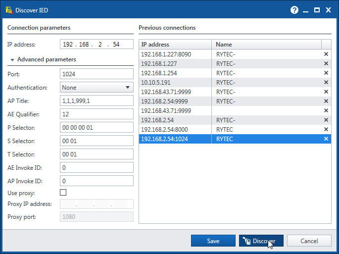
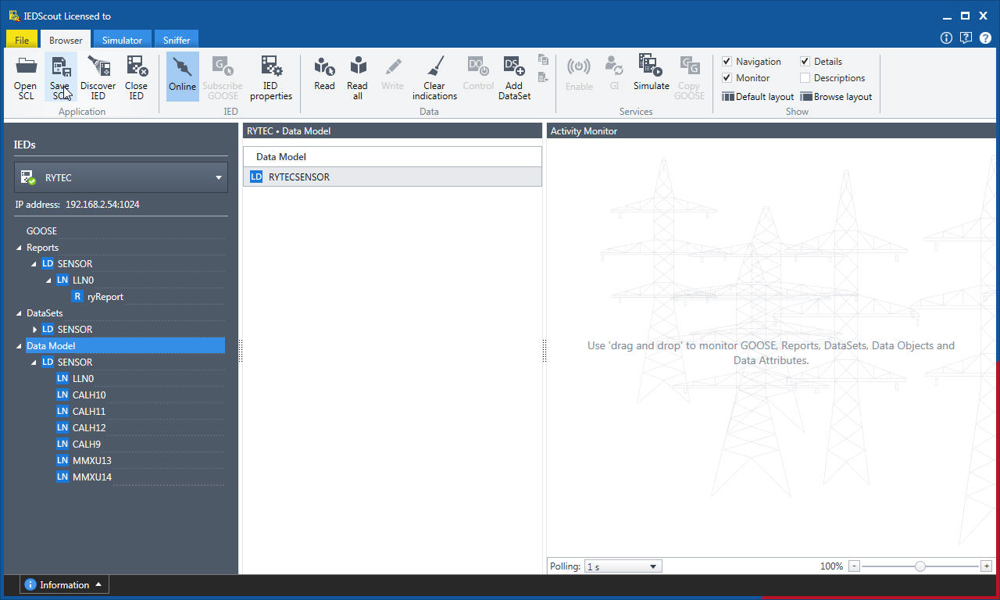
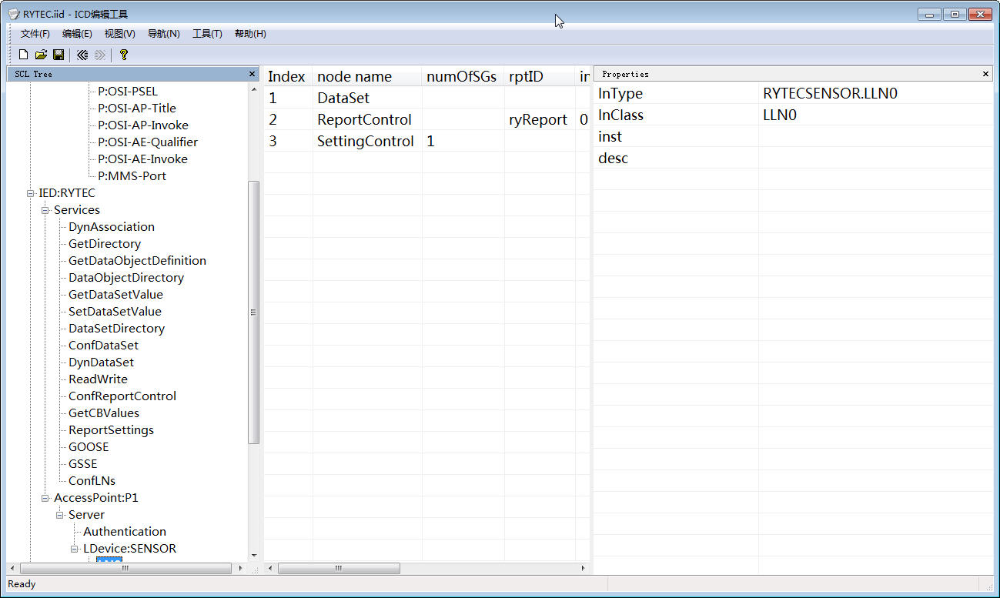

# 客户端

## 基本信息

1. http://服务器地址:8080/
2. http://服务器地址:8080/admin.jsp 管理界面，请使用任何浏览器打开。

## 客户端配置

注意：客户端配置文件不能用普通的编辑器编辑，需要用支持UTF8的编辑器！！！windows下面请使用写字板，已经测试是兼容的。

配置文件在软件的resources目录下面。

```json
{
    "company": "成都荣耀科技有限公司",
    "appName": "智能辅助控制系统",
    "url": "http://192.168.2.227:8080"
}
```

company：公司名称

appName：应用名称

以上两个名称到时候会显示到程序的窗口条当中。

url：服务器的URL和端口

## 软件使用

软件打开后，直接进入界面，不需要登录。

快捷键：

1. F5 刷新界面
2. F6 清除缓存，刷新界面
3. F12 打开调试窗口

## 常见问题

1. 如果客户端运行报错，可能需要安装 resources下面的vcredist_x86.exe。

# 服务器设置 

1. 服务器IP：缺省是 192.168.1.227 和 192.168.2.227
2. 服务器用户名：rytec
3. 密码：123456

## 61850设置（老）

61850使用动态模型。

### 配置文件编辑

在rytec/rec-serverice 目录下，配置文件内容如下。请登录服务器，使用nano进行编辑。

```ini
[mqtt]
host=localhost
port=1883

[61850]
ip=192.168.2.244
port=1024

iedName=RYTEC

dsName=dsIAS
dsInputName=dsIAS_D
dsAnalogName=dsIAS_A

ldName=SENSOR

lnValue=value
lnValueInput=value
lnValueAnalog=value

reportName=ryReport
```

这里一般只需要修改[61850]这一段的某些参数。

1. port，61850的服务器端口号，一般最好设置在1024以上。
2. iedName，IED名称，英文
3. dsName，数据集名称，新版本已经不使用，但是需要保留。
4. dsInputName，遥信（开关量）数据集名称。
5. dsAnalogName，遥测（模拟量）数据集名称。
6. ldName，逻辑设备名称，英文
7. lnValue，逻辑节点监测值对应的名称。目前开关量和模拟量采用一个名称。
8. lnValueInput，遥信（开关量）逻辑节点的值名称，未使用，但是需要保留。
9. lnValueAnalog，遥测（模拟量）逻辑节点的值名称，未使用，但是需要保留。
10. reportName，报告名称。

其他参数现在暂时没有用。

### 61850 配置

1. 在管理界面中的《61850上报》中勾选相应的设备。
2. 刷新服务器

任何时候刷新服务器，都会导致服务器的所有参数重新配置，61850的模型也会重新生成。

目前，只能是《开关输入》设备和《模拟输入》设备是有效的，其他类型的设备即使勾选都不会生成61850的模型。

### 编辑模型文件

使用《OMICRON IEDScout》软件，第二个功能《Discover IED》。



填写ip地址和端口好，点击Discover按钮连接服务器。



连接服务器后，使用Save SCL 功能保存动态模型。

最后使用ICD编辑工具编辑模型。注意模型是生成的，因此不要编辑节点等信息，只能改变desc描述！！！！，添加或者删除节点后，重新刷新服务器器，然后重新下载模型文件并编辑。