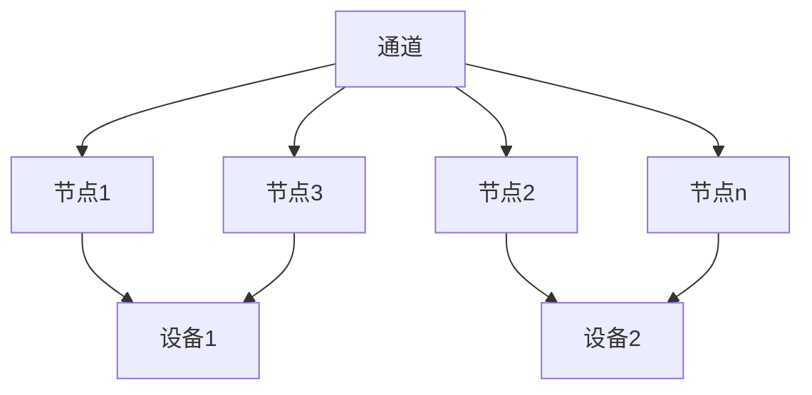
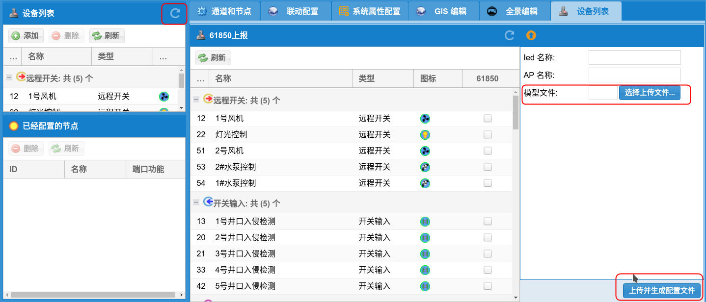

[TOC]

# 基本信息

1. 监控界面：http://服务器地址:8080/
2. 管理界面：http://服务器地址:8080/admin.jsp 管理界面，请使用任何浏览器打开。
3. 常用工具：http://服务器地址:8080/tools
   1. 61850_client-新版.rar：61850客户端测试软件
   2. HeidiSQL.zip：Mysql 客户端软件
   3. ICD编辑.rar：61850模型编辑软件
   4. NotePad.rar：windows下面的文本编辑器，支持UTF8
   5. SCL Designer.zip :61850的模型编辑器，推荐使用
   6. ivs-64.icd：61850标准模型，在该基础上编辑
   7. rec-client.rar：智能辅助控制系统客户端，没有视频支持
   8. ssh-ftp：ssh和ftp二合一软件

# 基本概念




## 通道：

 一个具备独立IP地址的设备与辅助系统服务器可以进行通讯的设备称为一个通道。例如：一个串口服务器、一个NVR、一个数据库服务器等。

## 节点：

一个通道下面会有不同的功能节点，例如：

1. 串口服务器：包括不同485地址下面的对应功能；
2. NVR：包括不同的摄像机通道；
3. 数据库服务器：典型的是科华的光纤测温，里面有不同的分区

## 设备：

设备是一组节点的组合，常用的设备有：

1. 开关
2. 模拟输入
3. 开关输入
4. 摄像头
5. 光纤测温
6. 环流
7. 空调
8. 全景

# 系统配置

一般涉及串口服务器配置、服务器配置、配置界面等几个方面。

## 服务器配置

## 串口服务器配置

## 配置界面

### 通道

### 节点

### 设备

### GIS配置

### 全景配置

### 联动

## 问题调试与解决


# 客户端使用

## 客户端配置

**注意：客户端配置文件不能用普通的编辑器编辑，需要用支持UTF8的编辑器！！！windows下面请使用写字板，已经测试是兼容的。推荐使用NotePad编辑器！！！**

配置文件在软件的resources目录下面。

```json
{
    "company": "成都荣耀科技有限公司",
    "appName": "智能辅助控制系统",
    "url": "http://192.168.2.227:8080"
}
```

company：公司名称

appName：应用名称

以上两个名称到时候会显示到程序的窗口条当中。

url：服务器的URL和端口

## 软件使用

软件打开后，直接进入界面，不需要登录。

快捷键：

1. F5 刷新界面
2. F6 清除缓存，刷新界面
3. F12 打开调试窗口

## 常见问题

1. 如果客户端运行报错，可能需要安装 resources下面的vcredist_x86.exe。

# 服务器设置 

服务器两个网络端口，靠外的是192.168.1.227，靠内的是192.168.2.227。直接使用浏览器打开服务器基本管理界面。

1. 服务器IP：缺省是 192.168.1.227 和 192.168.2.227
2. 管理界面：http://服务器地址
   1. 管理界面用户：admin
   2. 管理界面密码：123456
3. ssh用户名：root
4. ssh密码：123456

## 服务器基本配置

http://服务器地址:8080/admin.jsp 访问服务器配置界面。

## 通道和节点

一个通道上有很多个功能节点，一般来说，一个通道是一个485总线到IP网络的一个映射。会有IP地址和端口的属性。

Modebus服务器：IP地址指485-LAN转换器的IP地址，端口是转换器上配置的端口。Modbus设备的设置请参考本文档的其他部分。

节点：一个通道下面具体的功能节点

1. 地址：485地址
2. 端口：485设备的端口号，一般是从1开始，具体请参考相应的485设备。
3. 名称：节点的功能名称
4. 节点类型：不同的485设备有不同的类型，
5. 节点功能：
   1. 缺省：大多的功能节点都应该选择这个
   2. 反馈：摇信节点，远程开关的反馈
   3. 远程/就地切换：摇信节点，远程开关的工作模式
6. 是否关联：一个节点是否关联到了相应的设备。关联为绿色，没有关联为红色。

节点参数配置：用于摇信、遥控、模拟量遥测的配置。

1. 针对摇信、遥控，线性参数A决定摇信、遥控量是否反向；
2. 针对遥测，灵敏度确定两次采样值差的绝对值要到达或者超过这个值才会更新；
3. 线性参数A和B是针对模拟量采集，通过电流计算值来决定的。f(x)=A*x+b;
4. 计量单位：遥测的计量单位，用于显示。
5. 缺省情况，或者不填，灵敏度、线性参数A、线性参数B都为1；

## 61850配置

推荐使用“ICD编辑.rar”进行模型文件的编辑。

工作流程：

1. 下载标准模型
2. 编辑模型，验证模型
3. 上传模型，并使模型生效

### 下载标准模型

服务器文件：ivs-64.icd参考《基本信息》

### 编辑模型

目前可以实现摇信、遥测、遥控三种功能；其中遥控是单点控制。

使用SCL Designer 打开模型文件。

**注意！任何不用的节点，请清空sAddr，或者是填0；任何不用节点的相应描述修改成备用！！！**

#### 接入点信息


编辑IP，IP-SUBNET等信息

#### 逻辑设备编辑


Name：QQ1101 为逻辑设备的名称

#### 摇信节点

编辑三个地方：

1. 节点描述：desc
2. 节点与系统的对应关系：stVal的sAddr字段，与设备的ID一致。
3. dU节点的val值：一般和节点描述一致


#### 遥测节点

与摇信节点类似，只是对应设备ID变成了mag节点中f节点的sAddr


#### 点单控制节点

和摇信类似，Oper节点是控制节点，desc描述要写“XXX控制”；stVal为状态节点，desc描述写成“XXX状态”，并且sAddr和设备ID对应。


### 上传模型文件

上述步骤中编辑好的模型文件需要上传到服务器。

在管理界面中的设备列表功能中，选择上传的模型文件，并点击“上传并生成配置文件”。最后点击左边“设备列表”右边的刷新按钮来刷新配置。完成后，61850的配置就完成了。




