[TOC]


# 基本信息

1. 监控界面：http://服务器地址:8080/
2. 管理界面：http://服务器地址:8080/admin.jsp 管理界面，请使用任何浏览器打开。
3. 常用工具：http://服务器地址/tools
   1. 61850_client-新版.rar：61850客户端测试软件
   2. HeidiSQL.zip：Mysql 客户端软件
   3. ICD编辑.rar：61850模型编辑软件
   4. NotePad.rar：windows下面的文本编辑器，支持UTF8
   5. SCL Designer.zip :61850的模型编辑器，推荐使用
   6. ivs-64.icd：61850标准模型，在该基础上编辑
   7. rec-client.rar：智能辅助控制系统客户端，没有视频支持
   8. ssh-ftp：ssh和ftp二合一软件

# 基本概念

## 485与Modbus

### 485通讯总线

我们大多的开关量输入、开关量输出、模拟量采集等设备都是基于485的Modbus设备。

485 是一种类似串口的通讯方式，但是是总线的方式。每个485设备都挂在一条总线上，A线和B线：


所有485总线上的设备具有一个地址（一个Byte），称为从设备。等待主设备的通讯发起。主设备一般是我们的服务器。主设发送的数据的第一个字节是地址字节，只有与这个地址一致的从设备才会相应主设备发送的命令。485通讯属于轮循方式，从设备不能主动发送数据，因此通讯效率比较低。

485通讯有以下特点：

1. 每个设备有一个地址，地址为一个Byte，一般从0~255。但是由于一些厂商会使用0\255\254作为特殊地址使用，所以地址一般选用1~253。
2. 设备分为主机和从机。
3. 通讯距离可达1500米。
4. 通讯速率一般是9600bps，速率越快，通讯距离可能越短。
5. 理论上同一总线上可以安装255个设备，但是效率会急剧下降。
6. 是轮循的通讯方式，所以通讯需要主机发起，通讯效率比较低。

### Modbus通讯协议

modbus协议实在485物理通讯链路上的一种数据传输与控制协议。每个Modbus设备除了有485的地址外，还有一个或者多个寄存器地址。每个寄存器对应一个功能（例如，一个开关量端口，一个模拟量端口、或者是一个开关控制端口）

## 系统中的基本概念

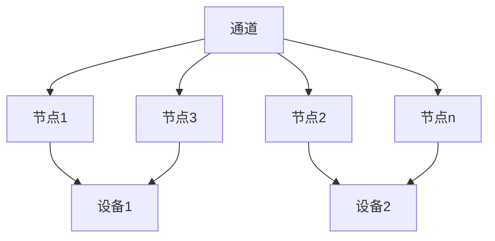

### 通道：

 一个具备独立IP地址的设备与辅助系统服务器可以进行通讯的设备称为一个通道。例如：一个串口服务器、一个NVR、一个数据库服务器等。

一个串口服务器可以看做一个网络化的485总线。

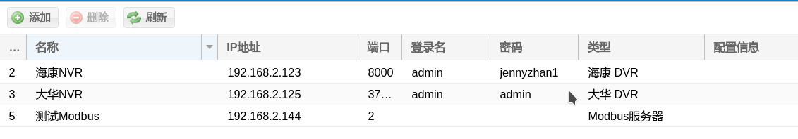

### 节点：

一个通道下面会有不同的功能节点，例如：

1. 串口服务器：包括不同485地址下面的对应功能；
2. NVR：包括不同的摄像机通道；
3. 数据库服务器：典型的是科华的光纤测温，里面有不同的分区

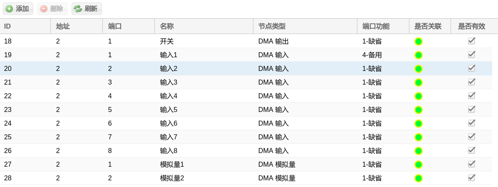

节点：一个通道下面具体的功能节点

1. 地址：485地址
2. 端口：485设备的端口号(寄存器地址)，一般是从1开始，具体请参考相应的485设备。
3. 名称：节点的功能名称
4. 节点类型：不同的485设备有不同的类型，
5. 节点功能：**不同的设备，其功能含义可能不同！**
6. 是否关联：一个节点是否关联到了相应的设备。关联为绿色，没有关联为红色。

### 设备：

设备是一组节点的组合，**设备可能会持续添加**，常用的设备有：

1. 开关
2. 模拟输入
3. 开关输入
4. 摄像头
5. 光纤测温
6. 环流
7. 空调
8. 全景

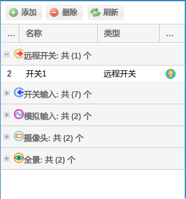

每个设备具有名称、类型和图标三种属性。

# 系统配置

一般涉及串口服务器配置、服务器配置、配置界面等几个方面。

## 串口服务器配置

串口服务器是一个串口/485转网络的设备。通过浏览器可以打开串口服务器的配置界面。

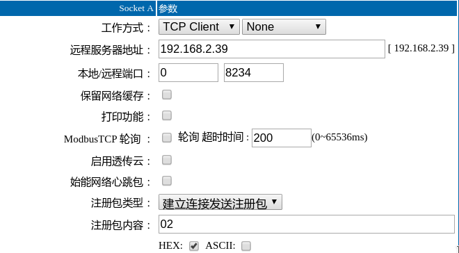

一般在Port端口中进行设置，不同的串口服务器设置方式不一样。大约需要设置以下参数。

1. 工作方式：TCP Client，None
2. 远端服务器地址：这就是我们服务器的地址。
3. 远程端口：8234，这是服务器的监听端口。
4. 注册包类型：建立链接发送注册包。
5. 注册包内容：01~FF，16进制，HEX格式。**注意在通道配置界面中的端口中需要转换成10进制。**

## 配置界面

服务器两个网络端口，靠外的是192.168.1.227，靠内的是192.168.2.227。直接使用浏览器打开服务器基本管理界面。

1. 服务器IP：缺省是 192.168.1.227 和 192.168.2.227
2. 管理界面：http://服务器地址
   1. 管理界面用户：admin
   2. 管理界面密码：123456
3. ssh用户名：root
4. ssh密码：123456

**配置一旦更新，需要点击左边设备列表标题中的更新按钮才能生效！**

### 通道


针对一般的串口服务器，类型选择Modbus服务器。

### 节点

对于Modbus设备而言，节点是一个设备对应的寄存器地址（端口功能）。

对于视频，节点是一个摄像机。

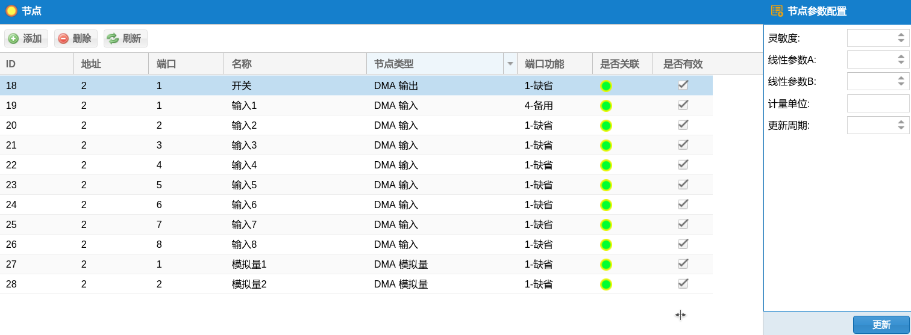 

对于Modbus设备：

1. 地址：485地址

2. 端口：Modbus设备的寄存器号。
   1. DMA输入、输入、模拟量：从1开始
   2. RF-WSD温湿度：1为湿度，2为温度
   3. 其他，一般为1

3. 节点名称：描述

4. 节点类型：不同的485设备有不同的类型，表示不同的设备

5. 节点功能：

   1. 缺省：大多的功能节点都应该选择这个。
   2. 反馈：摇信节点，远程开关的反馈。
   3. 切换：摇信节点，远程开关的工作模式。
   4. 备用：如果是远程开关，这里标示的是就地开关。

6. 是否关联：一个节点是否关联到了相应的设备。关联为绿色，没有关联为红色。

7. 是否有效：该节点是否使能，如果不使能，就不会与该节点进行通讯。

   ​

节点参数配置：用于摇信、遥控、模拟量遥测的配置。

1. 灵敏度：针对遥测，灵敏度确定两次采样值差的绝对值要到达或者超过这个值才会更新；**注意，灵敏度是AB参数计算出来结果的灵敏度。**
2. 线性参数A：针对摇信、遥控，线性参数A决定摇信、遥控量是否反向；
2. 线性参数B：线性参数A和B是针对模拟量采集，通过电流计算值来决定的。f(x)=A*x+b;
4. 计量单位：遥测的计量单位，用于显示。
5. 更新周期：多少次轮循执行一次，缺省是1。**如果一条485总线上链接的设备较多，建议把模拟量节点设置成10，或者以上。**
5. 缺省情况，或者不填，灵敏度、线性参数A、线性参数B都为1；

###  节点重定向

节点重定向是节点复用的功能。例如，需要一个开关量输入节点来实现多个开关（设备）的就地、远程切换，那么传统的方式不能实现，因为传统的方式中，一个节点只能属于一个设备。因此需要对节点进行复用。

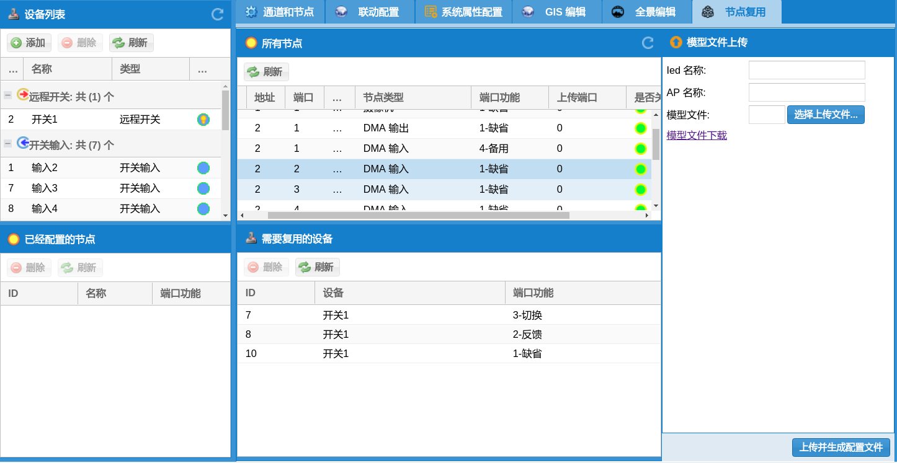

在【所有节点】列表中，选中需要复用的节点，然后从右边的设备列表中拖动需要使用该节点的设备到下部的【需要复用的设备】中。最后在端口功能中选中相应的功能即可。

### 设备


添加一个设备可以按+号进行添加，也可以把节点拖动到设备区域，这样不用输入设备的名称，而直接用节点的名称。

设备需要选择相应的类型和对应GIS的图标。

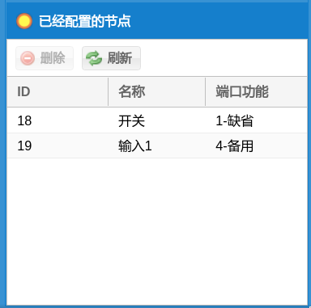

当选择好一个设备后，下面会出现该设备所对应的节点功能。例如上图，一个开关设备可能有四个节点，分别对应1~4号功能。大多的设备只有缺省功能（1）。

### GIS配置

对于一个较大的应用场景，例如隧道，需要把设备分派到不同的区域，这个区域可以就是图层。一个系统可以有任意多个图层。

一个设备可以有多个对应的GIS图标（点）。并且每个点不一定在一个图层。

GIS配置就是建立图层和把设备放置到图层中的过程。

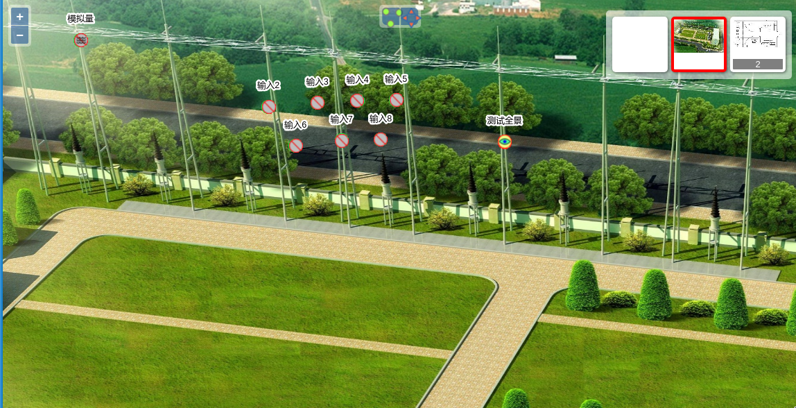

在GIS界面中，右上角是图层切换。中上部分是放置和移动设备的工具。

#### 图层管理

**注意！一个图层的文件不能太大，最好在8000x4000以内。另外，图层图片的宽高比例最好保持在2:1，否则图片显示可能变形。**

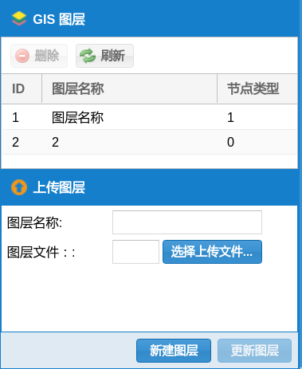

如果选中了一个图层，可以选中上传文件，并使用【更新图层】来更新当前图层的图片，或者使用【新建图层】来新建一个图层。如果没有在图层列表中选中图层，【更新图层】应该不可用。


在图层列表中，双击一个列表项，可以修改图层的名称。


选中一个图层，可以点击【删除】按钮删除图层。

#### 添加和删除设备

在GIS页面中，设备列表的下部会根据选中设备切换到GIS项目列表。设备列表下部的GIS列表表示设备在GIS中的位置。选中一个GIS项目，可以在GIS快速定位到这个设备在GIS中的图标。

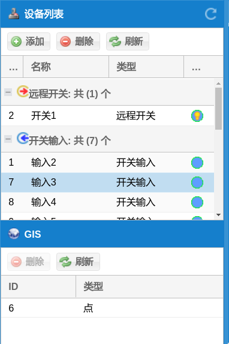

选中一个设备，在GIS上部中间中点开【点】工具（会黄色高亮），用鼠标左键单击可以把设备的图标添加到当前鼠标点上。如果图层不正确，可以先切换图层（GIS右上角图层工具）。当添加一个点后，在设备列表下部的GIS列表中会出现一个新的记录。一个设备可以对应多个点。


在一个设备的GIS列表中，选中一个GIS记录，可以单击【删除】按钮，删除该设备的一个点。


#### 移动设备

在GIS中移动一个图标很简单，选中【移动】工具（GIS中上部的工具），【移动】工具的图标会黄色高亮。然后拖动任意的一个设备图标到合适的位置就可以了。

### 全景配置

全景是对应一种特殊的【全景】设备打开的一种720°浏览界面，类似百度的街景。因此需要两个先决条件：

1. 在设备列表中有全景设备；
2. 全景设备需要在GIS中有相应的点；

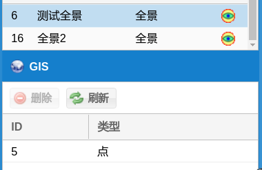

如上图，设备列表中，有特殊的全景设备，且已经在图层中有点。

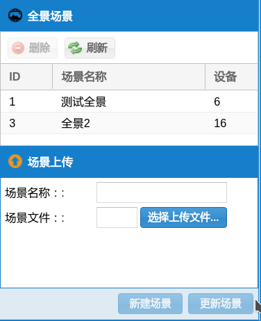

选中相应的全景设备才可以新建或者是更新全景图层，方法和GIS图层类似。注意设备列表中全景设备名称前面的数字编号6\16，在全景场景中，每个场景后面的【设备字段】表示该全景场景是属于那个全景设备的。


全景可以使用鼠标拖动。

全景中，添加设备时候需要现在设备列表中选中设备，然后：

1. alt+shift：鼠标左键，在鼠标位置添加设备；
2. 鼠标右键：删除鼠标指向的设备。

### 联动

联动界面关系到设备列表、关联设备、规则动作。联动一般有一个触发设备，一个或者多个规则动作所对应的设备。


当选中一个设备的时候，可能会出现一个设备参数配置，例如一个模拟输入。该设备会产生四种信号，用于联动。

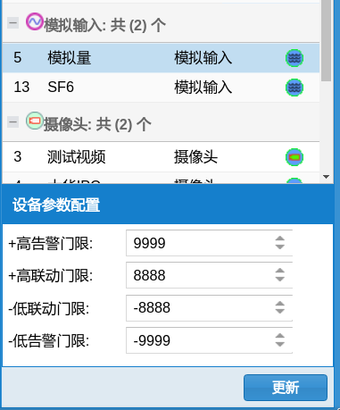、

添加一个联动规则，只需要把触发源的设备拖动到【联动规则】窗口，然后选择该设备不同的信号即可；

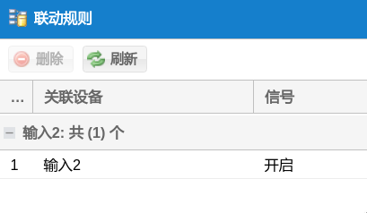

例如上图中选择了输入2设备的【开启】信号作为联动规则。


在联动规则下面添加规则动作，需要把动作所对应的设备拖动到【规则动作】窗口，然后设置动作和参数即可。

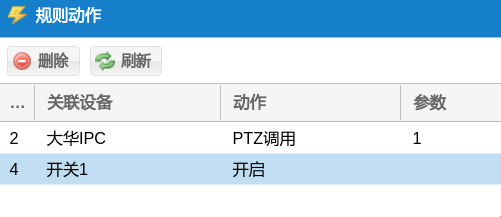

如上图，一个规则下面有两个动作，一个摄像机的PTZ调用，参数是1，表示移动到1号预置位；另外一个是把开关1打开。

## 问题调试与解决

在浏览器或者是客户端中，F12可以打开调试界面，调试信息可能对问题的解决有帮助。

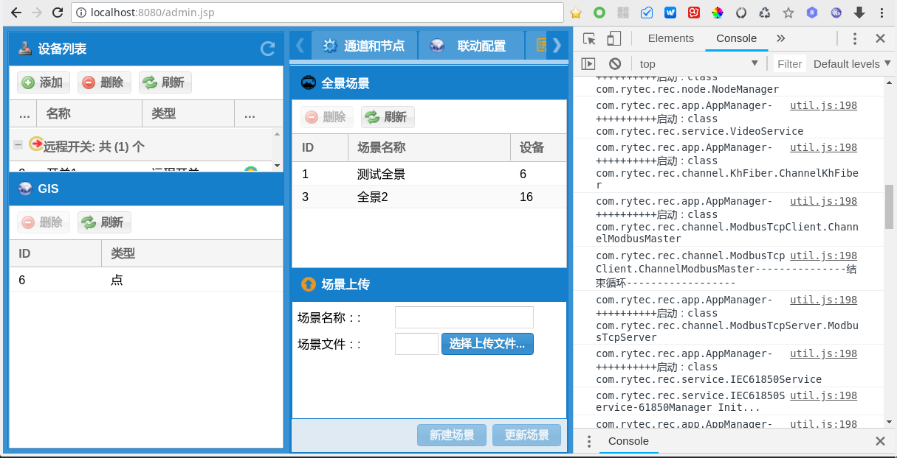

如上图，右边的调试界面中的【Console】中有必要的信息，如果有问题，可以用该信息协助解决问题。


# 客户端使用

## 客户端配置

**注意：客户端配置文件不能用普通的编辑器编辑，需要用支持UTF8的编辑器！！！windows下面请使用写字板，已经测试是兼容的。推荐使用NotePad编辑器！！！**

配置文件在软件的resources目录下面。

```json
{
    "company": "成都荣耀科技有限公司",
    "appName": "智能辅助控制系统",
    "url": "http://192.168.2.227:8080"
}
```

company：公司名称

appName：应用名称

以上两个名称到时候会显示到程序的窗口条当中。

url：服务器的URL和端口

## 软件使用

软件打开后，直接进入界面，不需要登录。

快捷键：

1. F5 刷新界面
2. F6 清除缓存，刷新界面
3. F12 打开调试窗口

## 常见问题

1. 如果客户端运行报错，可能需要安装 resources下面的vcredist_x86.exe。

# 61850配置

推荐使用“ICD编辑.rar”进行模型文件的编辑。

工作流程：

1. 下载标准模型
2. 编辑模型，验证模型
3. 上传模型，并使模型生效

## 下载标准模型

服务器文件：ivs-64.icd参考《基本信息》

## 编辑模型

目前可以实现摇信、遥测、遥控三种功能；其中遥控是单点控制。

使用SCL Designer 打开模型文件。

**注意！任何不用的节点，请清空sAddr，或者是填0；任何不用节点的相应描述修改成备用！！！**

### 接入点信息

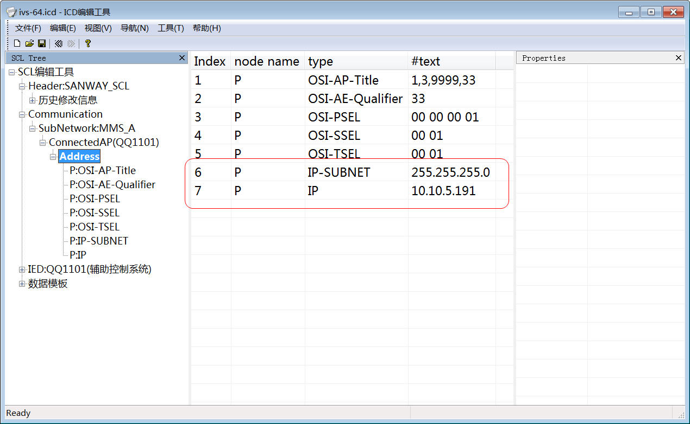

编辑IP，IP-SUBNET等信息

### 逻辑设备编辑

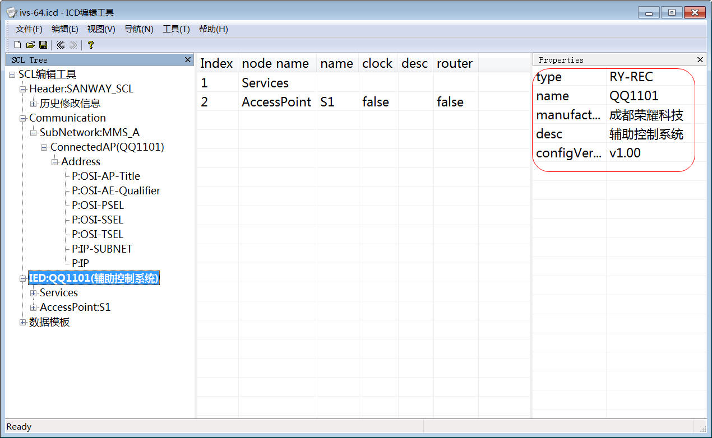

Name：QQ1101 为逻辑设备的名称

### 摇信节点

编辑三个地方：

1. 节点描述：desc
2. 节点与系统的对应关系：stVal的sAddr字段，与设备的ID一致。
3. dU节点的val值：一般和节点描述一致

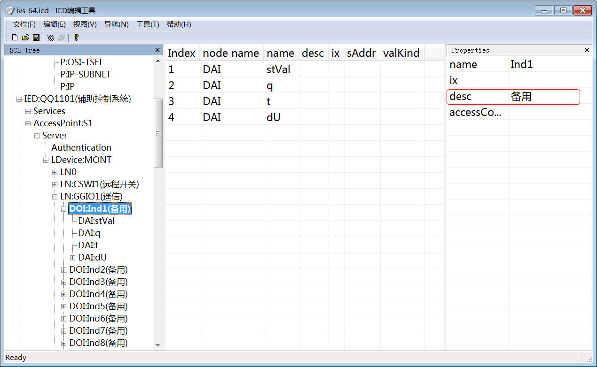

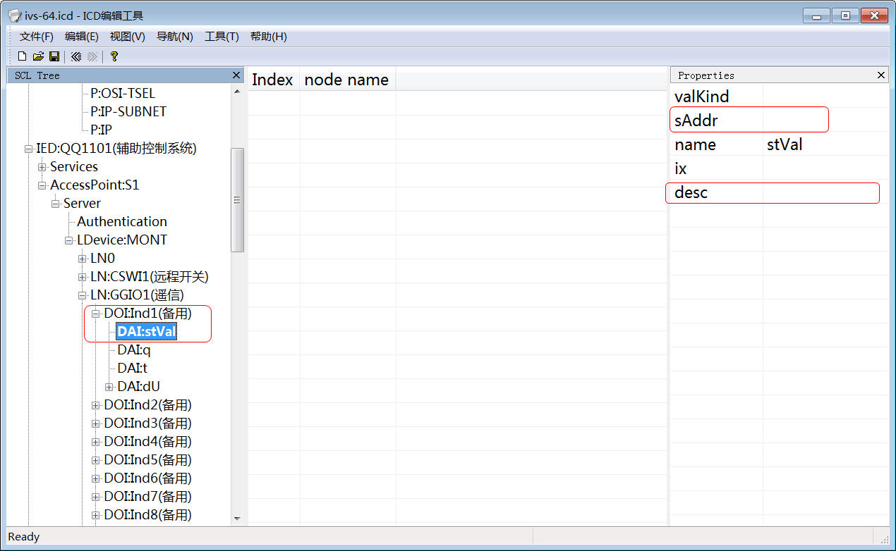

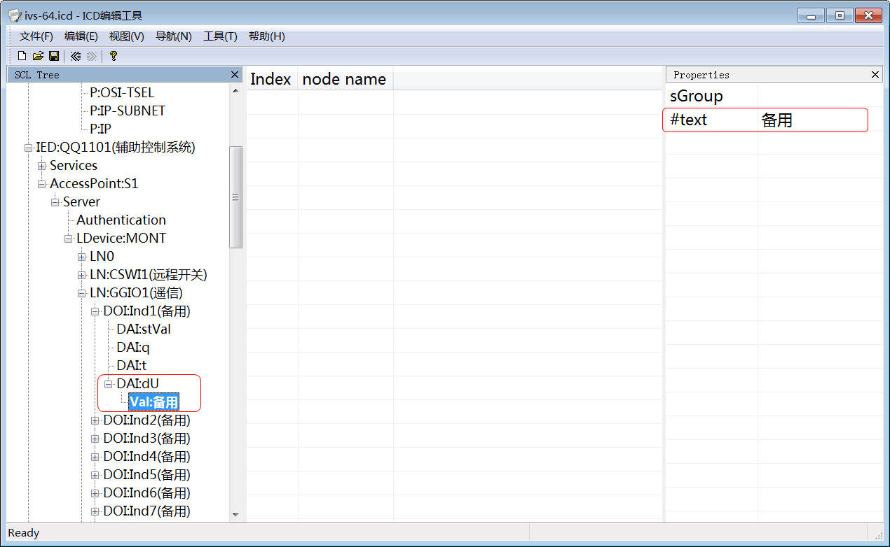

### 遥测节点

与摇信节点类似，只是对应设备ID变成了mag节点中f节点的sAddr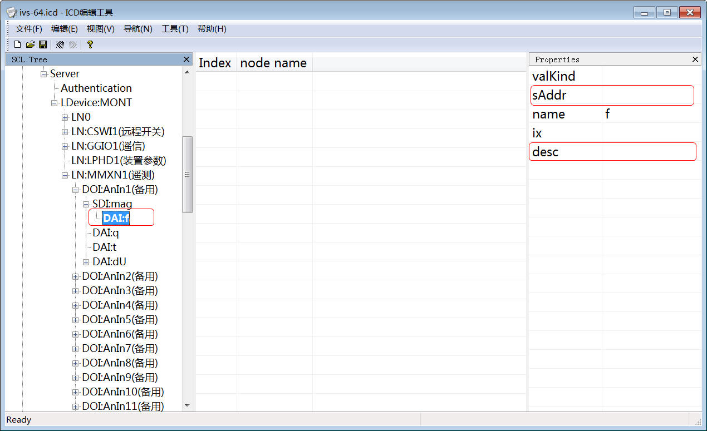


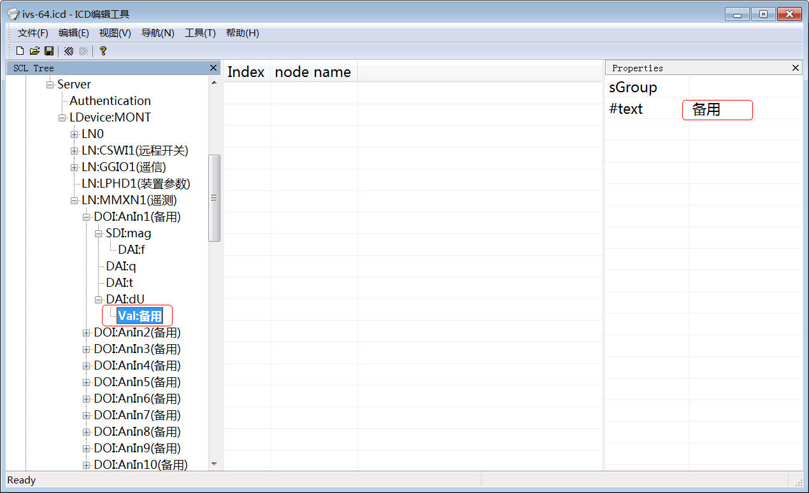

### 点单控制节点

和摇信类似，Oper节点是控制节点，desc描述要写“XXX控制”；stVal为状态节点，desc描述写成“XXX状态”，并且sAddr和设备ID对应。

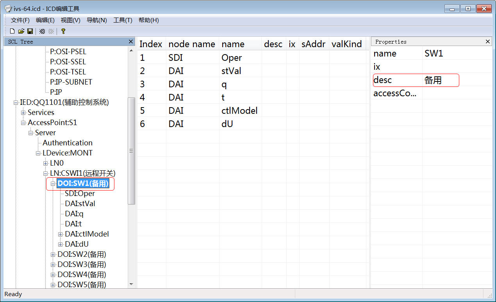

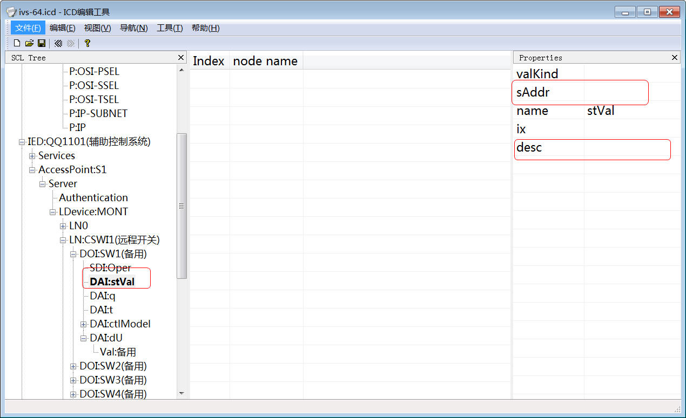


## 上传模型文件

上述步骤中编辑好的模型文件需要上传到服务器。

在管理界面中的设备列表功能中，选择上传的模型文件，并点击“上传并生成配置文件”。最后点击左边“设备列表”右边的刷新按钮来刷新配置。完成后，61850的配置就完成了。

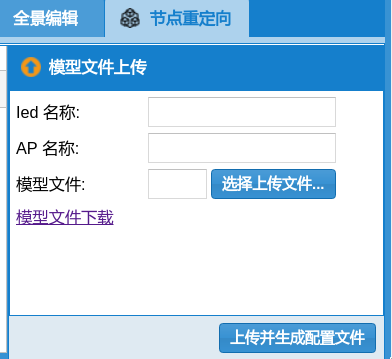

在该界面中：

1. 模型文件：需要上传的模型文件；
2. 模型文件下载：上传的模型文件从这里下载，也就是系统最新的模型文件；
3. 【上传并生成配置文件】：功能按钮，上传模型文件。

**其他参数目前没有作用。**