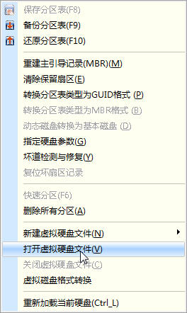
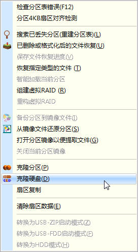
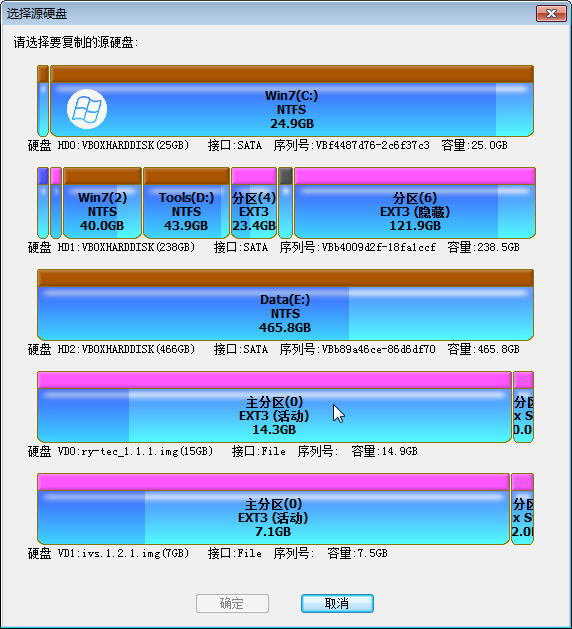
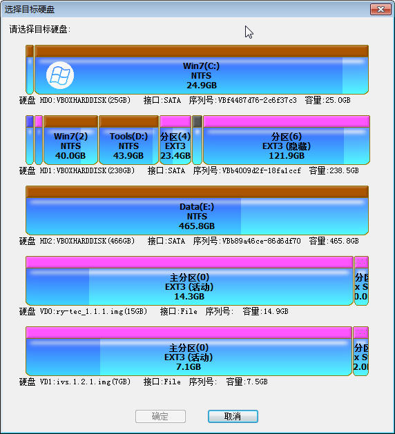
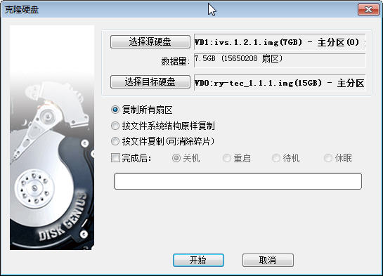
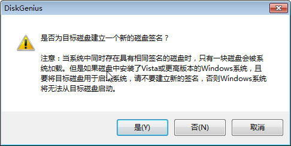

# 基本说明

使用 DiskGenius 64 位，在Windows 64位系统上完成恢复。

# 步骤

## 打开镜像文件

在**硬盘**菜单中，使用**打开虚拟硬盘文件**找到需要恢复的镜像文件。

## 回复到硬盘

在**工具**菜单中，找到**克隆硬盘**。

出现选择**选择源硬盘**和**选择目标硬盘**的界面。

**源硬盘**就是刚刚打开的虚拟虚拟硬盘，一般是**VDO**开始的。**目的硬盘**就是需要写入的SSD。一般说来，**目的硬盘**的容量不得小于**源硬盘**的容量。

在这个界面中选择**复制所有扇区**。

当被询问是**否建立一个新的硬盘签名**的时候，选择**否**。